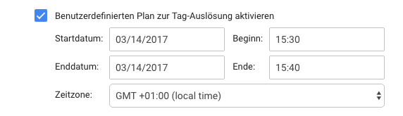
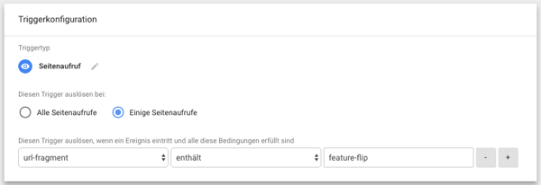
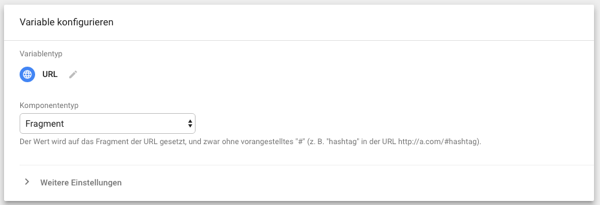

# Topics

* Wartungsfenster
* Farben anhand der Tageszeit wechseln
* Feature Flipper
* (Pseudo) Passwort Abfrage
* Bilder speichern im Tag Manager

## Wartungsfenster

Wartungen müssen manchmal im laufenden Betrieb gemacht werden. Wenn man an bestimmten Bereichen einer Webseite arbeitet, will man eventuell
auch nur bestimmte Bereiche sperren. Leider werden Wartungsarbeiten oft Nachts gemacht, damit der Entwickler aber nicht nachts wach bleiben
muss, kann er die Wartungswarnung einfach per Tag Manager steuern.

```javascript
  var body = document.getElementsByTagName("body")[0];
  var h1 = document.createElement("h1");
  h1.innerHTML = "Achtung die Webseite steht nicht zur Verfügung. Bitte probieren Sie es später noch einmal";
  body.innerHTML = '';
  body.appendChild(h1);
```


## Farben anhand der Tageszeit wechseln

Ähnlich wie man es von Navigationsgeräten kennt, kann man seine Webseite dem Tageslicht anpassen, so sollte die Webseite in der Nacht
möglichst dunkel sein und am Tag eine helle Farbe haben.

```javascript
<script>
  var body = document.getElementsByTagName("body")[0];
  var uhr = document.createTextNode("Es ist grade {{Uhrzeit}}");
  document.body.appendChild(uhr);
  body.style.backgroundColor = "{{bgcolor}}";
  body.style.color = "{{color}}";
</script>
```

```javascript
function(){
  return (new Date().getHours() > 6 && new Date().getHours() < 20 ? "white" : "black");
}
```

## Feature Flipper

In Zeiten von Continuos Delivery will man oft neue Features erst mal der QA verfügbar machen. 
Dazu werden einfach die Element die neu auf der Webseite sind mit "feature-xyz" als Klasse gekennzeichnet und im CSS mit `display:hidden` versteckt.
Über ein URL Parameter lassen sich diese Elemente wieder einblenden.

http://127.0.0.1:8000/#feature-flip

```html
<style type="text/css">
  .feature-xyz {display:none;}
</style>
```

```javascript
  var elements = document.getElementsByClassName("feature-xyz");
  for (var i=0, l=elements.length; i<l; i++) {
      elements[i].style.display = 'block';
  }
```






## (Pseudo) Passwort Abfrage

Unkritischer Content kann ein wenig geschützt werden. Natürlich ist eine Front-end Passwort Validierung kein richtiger Schutz,
wenn man aber etwas vor weniger technisch versierten Usern schützen will kann man das unter anderem auch mit dem Tag Manager machen.
Es gibt ein paar Hürden um das Passwort rauszubekommen. Javascript deaktivieren bringt in diesem Fall auch nichts, da der Tag Manager 
den Content ausliefert.

http://127.0.0.1:8000/#secret

```javascript
  var body = document.getElementsByTagName("body")[0];
  var h1 = document.createElement("h1");
  var response = prompt("What is the secret?");
  if (response != {{salt}}) {
    h1.innerHTML = "Passwort ist leider falsch";
  } else {
    h1.innerHTML = "Der Rabattcode für 50% off lautet: {{rabatt}}";
  }
  body.innerHTML = '';
  body.appendChild(h1);
```

## Bilder im Tag Manager speichern

Jede Datei lässt sich in base64 codieren, also auch Bilder.
Wenn mal kein Platz verfügbar ist, wo man ein Bild ablegen kann für ein HTML Snippet,
kann man es auch einfach im Tag Manager ablegen:

https://jpillora.com/base64-encoder/

Leider hat Google ihre JavaScript Regeln umgestellt, es ist nicht mehr ohne weiteres möglich einen so großen String abzuspeichern.
Dazu habe ich den Base64 String nun einfach aufgesplittet und wieder im Code zusammengefügt.

```javascript
  img = document.createElement('img');
  img.src = "data:image/gif;base64,R0lGODdheABzANUAAAAAAAwMDBQUFBwcHCQkJCsrKzMzMzw8PEREREtLS1NTU11dXWNjY2xsbHR0dHx8fISEhIqKipSUlJqamqSkpKurq7S0tLu7u8XFxc"
+ "vLy9TU1Nvb2+Tk5Ozs7PPz8////wAAAAAAAAAAAAAAAAAAAAAAAAAAAAAAAAAAAAAAAAAAAAAAAAAAAAAAAAAAAAAAAAAAAAAAAAAAAAAAAAAAAAAAAAAAAAAAAAAAAAAAAAAAAAAAAA"
+ "AAAAAAAAAAAAAAACH5BAkAACAALAAAAAB4AHMAAAb/wI9wSCwaj8ikcslsOp/QqHRKrVqv2Kx2y+16v+CweEwum8sTwuTMJmsQgDgi0653K4K4XlCx+68TeoJxEn+GURSDBoMUh45LGA"
+ "GCARaSegEYj5pFHQSDAhoDgwQdm6YMgwCknoMLppoXqQAGH4upFq+OtoMIHwmytLl/FbIACh8LxY3CdgfFDB8NxQfMdRnFAA4fD9iZ1WcO2BAfEdgN32YeBdiFgcUEHuhu2ACNxNga8l"
+ "waHJzrxbgsYCtQigiHfPqieEAlAIGEfkI6SJN14QOGZwU/cJCAIM+CeAmdJBMkwAHEDxVEDcp07VMfIRweqNTjKiQTbrIGFBKiYVec/3waFCH8MGHmIG02kwiMo8CSoAQQO8DRk2+DUw"
+ "QFOShIFWBrHFxJjajTU8GnHgLePPwCEGCDRktYhWBgpWipqoxhhZTTQyGcrAAvPcAR0I9DngMFLeSR1eBenHF5IxqNYJfrSw4EApTqEIAAxApOb0kQNABvUnd6GnDGRklIBoIf1Hm7EH"
+ "qQ5ol6duZ19vQD72IC6HxwK4S4hsXTfCmKHHRQgQ8Q6AGAbaTDP2wPaqUSnnQvaQ8XpSMt4pceBg9GH+edOmiDB7qyCngrguF6Tg9WU/VK2iH9V2TYKJCRBQ+A9UEHXsniSiypCGCaPC"
+ "2lEgFKxZzD01oAJDAUbox8MP+aLNwl5FgrByKX2hAUmAiAAMtE02A/qMjSYkLeLfdBgkwNEV0xkAHYm3ay9JhQebb1k4geBhS0ozhCeODTGhzUpsd4CcUoCy6GxQGKEKjRs9NxWvbDoC"
+ "zQ2FTjINndSIhcUrZZEVFxJCAETkEm5QEFCqgIwH6JUHOgfblJSYoQcCzD3h4KUABSWBxEYJ+Df3rD4SUY6AmAhfX104GJBERwEjoUJJDAAg9U8KkHEsz0JkgRDjLABv7FkZYQY+q0qE"
+ "YELiDqGpu0qmUCE2TEwURpDoHhKGPJst8QODFwUgcTJKDnfI4c6yoEGaUk5xBjpkLLb6m8KUQCA7x0IATwDbL/rSPN0aPGEByEiCMvyhWz7gf8oJguiI8sKV0CxBGhgZR6HDNSMUPBOy"
+ "92j/xGAJ05GSiEv6lAMymaRVwQqx4P0OWnIZsKgsGhXPEqhFlHbUPPc0NMQLAeB4Sn5YNt+NrAwNLx2i6P5EiH0JH0ZDBpiHZUtmIHEMuybZeytCPdTgsf5YGK5voBtB4RJFsMUlYq88"
+ "HVCgpBZCrwfCiIyX4wrcoH3aayDMqD9GG0t0KAPQgugAKgW9oyftD1SiVKV1HbDZbiqyDQjJjbIXYDQE1/f/WzczGZyIwNHVHm1A+4fB1CeBwVKR7HAPF8Pggdh98SW6yNmC6xHZPrse"
+ "3BerDc//ggQElXjxB512QtVYdALksmmNloNjZubaD7hL652o/lJNHcBsmyC2H0fmdqSYABBwh4oAIHGECApZCR/NLvcXxsSNKCvMnhfh8SoAAEFfBzaxEeHFQBBAqwwvyhFjIdAIplCO"
+ "gJwk9OglmTLJCB+0HBAxmwQEF+Qx3q6UFchngPNpaRAUvUpDoRlMADGsCABZiQAQ14gAQqkAHpxQgTQhDdWRzoB/bNkFbzw8sGKNAAA1gKOAZgAAUCdi4FrCpvU9oEznhWnQkg4GW6uw"
+ "QCgnUEik0iYY6I2uhuFZONCQIBDoCAAyzoqgecal8Fe0XqgMclL8KMaBkgI2l0EzuR5f+CdiSByNgEsC8FxOMBB9jAAbThgYWNL2WBC1su8lOxug0iZhaoUQFAsohEsExrAICABUY2CF"
+ "5djC1Y3MTx9JCJTgxChAbAwEwoMCxB1sNxG2jABhwzAAwYwAFMK80HUsc8ZvwNHl9LxQQWQAAL/EMAHigHBArluHJkbTHFLMAC7LYMQH2QGR6g3TF8JIgMZAAa/3iOMpl5AGV+IJx+w0"
+ "DsaqJNGuaiPMzLGwQmUCpW0GKcryxnJoFUrgdMwIosMxuV5GEBBBygMFAUxD0zCQdi6HMccOOKWzhwgAO8LikCXM44H6ABQJozoqqLjBHmVoxeKHMBFxDABRYQnXHI8ZT/Ij2CBjBA05"
+ "ratKb9aKlDLsARc3LgpkCtqfRi6gSdAqASD63GBibA1KY69alQjapUp+rUihi1T+bEAFW3ytWuNpWIfouiWMcan54tM58fJataybrNIeBxrXAFhlnJmda42lVZRXjrXe36nJY6IxEGiE"
+ "52kLhXuC5LLiU0oWIXy9jGOvaxkFVsISywgEgyAAMM0GRlPRTZznr2syfEIFFHS9osxOQBqH0ABCiDl5joymTJRC3aKkAqIojwAVkbTmp3m1oIuMUDENBVj4Ar2yPkSkiucYACFDCfDa"
+ "BWk0TogAQWgIAEPIBaRDDg6Ewms2C8JQ6aEcLBWkSXfNxuce0i/wC89nA/y1UNOkm0nh6WNZeKOXCN/7GIAmGyGEids3YguU4+Rimh4ZwFXpYgXRE41Fa9cGwIdtmPKRljhAgNAAIPuM"
+ "62ZPaxLB3tZIKAjIAtIqoE0IUAokIALpQXB/XCJMG3Qk8eieCdYkWYS3oYwAMSpGAiRMhP3ZXLfjXS34L4hDD//UkRloRcFq/txVskwtzQVmMIz1dseoDMAhpy0R87Mkf6TR+8igxiQZ"
+ "xjxERgchGcDMzhwJgIIxHAYg5bZfnKYU5IEo70IiSABDxRS8Lh8JhnVmZK7QKLaiaCk1VBgEbneFEeXsBEAjCUOn/gxmzjBRWPgN9eCpq/hAYSAP9UggA06yjLa5ZOj+EUBwqMqUeWxn"
+ "RYXbW3IeA3ADv5NJFDbYsAuCwViEa1olW9qKmEVyXejfWVdaSnXtq6dhrQAB7A+7whe1iXotbAxYKtnmGPjgIVqIAE3uzmFoP7Ot7wznjsci+NRCt6RYgQy+p11HKPmlW1G8KhPczGU3"
+ "d7CE6e92ru7WBsIMUx6/JOmSo8E6JlrtUc0NgFC90ADmyAPRYSNR3OxO19evvJ3yW4qGUBTEb6+qd0adFqM8CBDoRCD0Rr3iVIU5CrBcApAeDOLuiAyY43+cBQJjifl7vcmYClayaaZE"
+ "QsIWdBtFnKxQAMET6pNyJcRzgjAiudCIjcL6CHXMHlyTh841CTDnBudPNJoCzey63+DUAAAzDAzYwwAQNYIgAIEG2e4D6UX3SK7m8XgLM1Mj4BfMw6cjZAPKQlZwxqoPDU8UDH9rAALH"
+ "LAAXTB+0Xx14EOuBPgNP3UEDzQebx4QAPuLL0DSd95IrC+IK8XS+nxN9MWJuH0NAVraTWhAQj4/vfAD77wh0/84hv/+MhPvvKJj8W/Ffb50I9+KtqtV+lb//qGzSv2t899tbY7pTcPv/"
+ "jHT/7ym//86E+/+tfP/vILYPO7j7/850//+tv//vjPfxuCAAA7";
  var body = document.getElementsByTagName('body')[0];
  body.appendChild(img);
```

